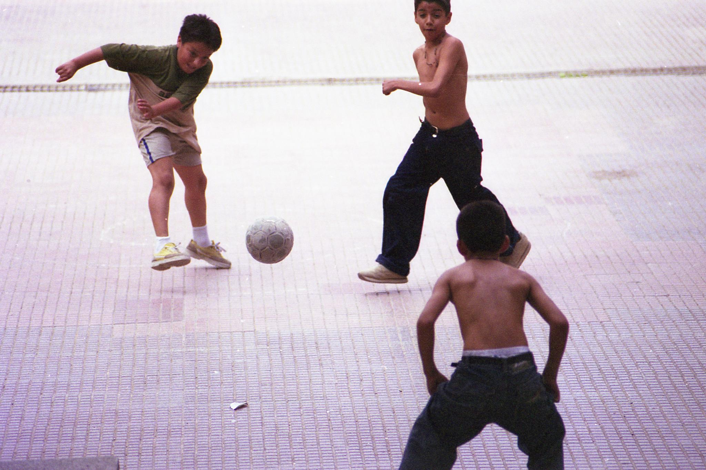

# Automatic-Image-Captioning
Caption generation is a challenging artificial intelligence problem where a textual description must be generated for a given 
photograph.

It requires both methods from computer vision to understand the content of the image and a language model from the field of natural 
language processing to turn the understanding of the image into words in the right order. Recently, deep learning methods have achieved
state-of-the-art results on examples of this problem.

Deep learning methods have demonstrated state-of-the-art results on caption generation problems. What is most impressive about these 
methods is a single end-to-end model can be defined to predict a caption, given a photo,

## Project Overview
* Prepare Photo And Text Data
* Develop Deep Learning Model
* Train With Photo Data
* Evaluate Model
* Generating Captions Images

## Python Environment
To run this progarm you have a Python SciPy environment installed, ideally with Python 3. You must have Keras (2.1.5 or higher) 
installed with either the TensorFlow or Theano backend.You also have scikit-learn, Pandas, NumPy, and Matplotlib installed.

## Dataset
The dataset is available for free. You must complete a request form and the links to the dataset will be emailed to you.
[Request Form](https://forms.illinois.edu/sec/1713398) 
Within a short time, you will receive an email that contains links to two files:
* Flickr8k_Dataset.zip (1 Gigabyte) An archive of all photographs.
* Flickr8k_text.zip (2.2 Megabytes) An archive of all text descriptions for photographs.

## Defining the Model

## Output
 
__Predicted Output: __ three boys playing in the grass
## Dependencies
* Keras
* Tensorflow
* Numpy
* pandas
* Matplotlib
* Pickle
* OS module
